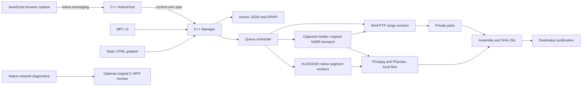

# Native UDM architecture

## Implementation

The desktop, engine, browser host and network monitor are native x64 C++17. The UI uses MFC; the release links static MFC and CRT. There is no managed CLR entry and no C# subprocess. `native/README.md` maps modules to source files. `src/` is the retained legacy implementation.

The browser captures page metadata and observed requests, correlates video and format identities, and sends usable URLs or a captured SABR session. No yt-dlp or other external URL resolver runs. The original SABR implementation preserves unknown protobuf fields, checks stream identity, bounds frames, rejects encrypted media and gaps, and assembles verified selected tracks. Live compatibility is still experimental.

## Persistence and transfers

The native model preserves the earlier PascalCase JSON schema, .NET dictionary arrays, `/Date(ms)/` dates and ISO dates. Unknown fields survive serialization. Secrets use current-user DPAPI. Loading an existing state retains a pre-native backup; saves atomically replace JSON and keep the previous version. Active records become paused after restart.

HTTP probes validate byte ranges and resource validators before parallelism or resumption. Requests belonging to one transfer share a WinHTTP session with origin-specific connection handles. Finished workers can split sustained slow active ranges before taking more queued work, based on observed rates and estimated remaining time. Without reliable rate differences they split larger tails after the queue is exhausted. Range ownership is persisted before writing, and assembly follows file offsets. See [0.10.0 transfer-engine validation and IDM comparison](reverse-engineering-0.10.md). The engine verifies lengths/ranges and optional SHA-256, marks Internet origin, and publishes without replacing an existing destination. Partial data remains under the state directory. Video/audio tracks are internal children; FFmpeg only consumes local files and FFprobe checks final video height and audio.

The worker-facing HTTP facade uses asynchronous WinHTTP operations internally. Workers check cancellation while awaiting callbacks and close their own request after the API returns. Callback context and read/POST buffers remain alive until HANDLE_CLOSING, including stalled headers and bodies. See [0.10.1 stress results](stress-testing-0.10.1.md).

A crash between destination publication and the completed-state save still needs recovery reconciliation. Assembly can require an extra file's worth of disk space. Files over 4 GiB and process termination during transfer were tested in 0.10.1. Disk-full, power-loss and every publication crash boundary remain future validation work.

## Browser boundary

The application exposes no public HTTP listener. Its pipe uses the current user's SID in both name and ACL, rejects remote clients, and bounds each message to 256 KB. I/O and shutdown have cancellable deadlines. The server keeps a response available until the single-request client closes, avoiding the unread-data loss caused by immediate DisconnectNamedPipe. See Microsoft's [pipe teardown documentation](https://learn.microsoft.com/en-us/windows/win32/api/namedpipeapi/nf-namedpipeapi-disconnectnamedpipe).

The host starts the native desktop if needed. A browser handoff is acknowledged only after the record is saved; File Info can wait for user confirmation. Duplicate suppression covers matching active/queued/awaiting jobs. A persistent request-ID ledger and every crash boundary are not yet covered.

For cross-site HTML5 players, `media.js` parses bounded clear recorded HLS/static MP4 DASH and `sites.js` binds offers to the current frame/player. `Adaptive.cpp` validates the segment plan, downloads in parallel with WinHTTP, saves hashes of completed parts, assembles local tracks and verifies the final MP4. Plans and optional exact-origin cookie maps are protected with DPAPI. See [cross-site video](cross-site-video.md) for association rules and unsupported cases.

The extension remains a development package. Account-specific cookies, signed URLs and changing streaming protocols can still prevent capture or transfer. Missing or rejected streams require fresh capture; the UI must not claim a lower quality completed the requested one.

## Driver boundary

Native endpoint diagnostics work without a kernel driver. UDM's optional original C WFP driver observes scoped process traffic and counters. It has compiled and passed static and INF checks, with a separate development test signature, but has not been installed or kernel-tested. It cannot decrypt browser TLS or supply missing video session tokens. Desktop and driver releases remain independent.
