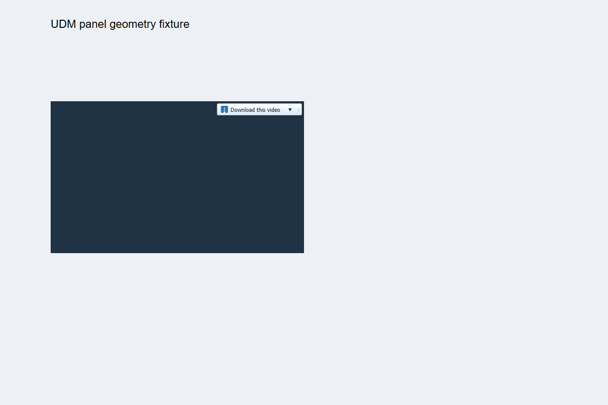

# UDM 0.11.0: implemented improvements and validation

The IDM investigation now informs two implemented changes: longer initial HTTP ranges and event-driven video panel placement. The release also fixes an extension preparation script that would have removed newer integration capabilities. The C++/MFC application and its native host have been built, and the desktop is running as version 0.11.0.

## Download engine

Fresh validated range downloads start with one contiguous range per configured worker, subject to the existing 1 MiB minimum. Previously they started with four times that number of partitions. This avoids repeated request startup delays. Existing adaptive splitting still lets idle workers help slow unfinished ranges. Saved plans retain their boundaries, so existing paused downloads are compatible; this change does not discard previously downloaded bytes.

The response validation, resource-change handling, cancellation, hashing and collision checks remain in the production transfer path. New checks inspect actual server requests and verify final bytes. Existing coverage still tests early help for a saved sixteen-chunk plan.

## Measured comparison

Each profile used three alternating pairs of UDM 0.10.1 and the candidate engine: 18 sequential downloads, identical 32 MiB bytes, eight workers, a fresh state per run, an expected SHA-256 in UDM, and an independent hash of each completed file. Median times include transfer, assembly, verification and publication. The candidate benchmark binary was built before the final version-string stamp; its transfer algorithm matches the released engine.

| Local fixture | 0.10.1 median | New median | Completion-time reduction | Median data requests |
|---|---:|---:|---:|---:|
| latency | 4.052 s | 2.888 s | 28.7% | 33 → 8 |
| steady | 3.580 s | 3.001 s | 16.2% | 33 → 8 |
| straggler | 3.560 s | 3.535 s | 0.7% | 36 → 16 |

The latency profile adds 180 ms before each data response; steady responses deliver 32 KiB approximately every 8 ms; the straggler profile slows the initial range at offset zero. The straggler timing difference is too small to claim a meaningful gain. The measured improvements establish lower overhead on these fixtures. Public Internet performance and a new IDM comparison remain unmeasured.

Full payload SHA-256: `66b984d4671b3299be00d015d20e04e59412d99fcc8bf6ee933a6038632044f5`.

[Results, build/source hashes and individual runs](reference/improvements-0.11.0.json). Reproduce with `tests/performance-0.10/range-bench.cjs` and two separately built production-engine benchmark executables. Requests and original logs remain in `benchmarks/improvements-0.11.0/ranges`.

## Browser integration

The panel now observes player and ancestor resizing, intersection changes, relevant style/class/ad-state changes, open shadow roots and visual viewport changes. Placement accounts for clipping ancestors and ancestor opacity/visibility. Mostly clipped or hidden players lose their panel, and removed players release their observers. Reparented players update their watched ancestors. Container fullscreen works for an open-shadow player. The compact panel retains its 168 × 24 CSS-pixel default size.

Preparation now treats the Chromium manifest as canonical, preserving the version, existing public identity key, permissions and content scripts, while synchronizing Firefox sources. The stable Chromium ID remains `kahfappnpjdcboccpnhinkcobcdgbdpl`. Both extension manifests are version 0.11.0. An already-running unpacked extension needs a reload and its pages need refreshing; no connected Chrome session was available for live extension reloading during final desktop validation.

## Validation

| Coverage | Passed |
|---|---:|
| Native C++ regressions | 97 |
| Existing browser/capture/UMP/media checks | 61 |
| Real Chrome panel checks | 16 |
| Repeated preparation preserving manifest/identity | 1 |
| Production-engine stress groups | 24 |
| Protocol and damaged-storage groups | 11 |
| Native host framing and running desktop pipe | Yes |
| Native Help → About displays 0.11.0 | Yes |

The 24 engine groups include 40 size/worker combinations, retries, changed resources, fallback modes, rejected invalid ranges, queues, aggregate limiting, real process termination/resume and five pause/reload cycles. They also include 240 sequential downloads with settled handle counts of 244 then 239.

The large-file test completed 4,295,032,833 bytes in 130.27 seconds with the expected SHA-256; peak working set was 16,297,984 bytes. [Engine details](reference/engine-stress-0.11.0.json) and [protocol/storage details](reference/protocol-stress-0.11.0.json).

The browser's former hard-coded version assertion expected 0.8.0 and failed after the release bump. It now validates a numeric version and agreement between Chromium and Firefox; the affected suite then passed. Panel tests run the actual content script in isolated headless Chrome with a stubbed messaging API, independently of native-host verification. This is not an end-to-end live YouTube capture test.

## Remaining work

Full IDM parity remains unfinished: current live media-token/SABR behavior, broad site/ad compatibility, complete native panel/workflow parity and production driver integration require further implementation and testing. Complex animated transforms, arbitrary clip paths, closed shadow roots and all iframe combinations are outside the demonstrated panel coverage. The original research driver and Windows signing/Test Mode settings were not changed in this release.

## Run and reproduce

Run `release/UDM.exe` or extract `UDM-0.11.0-source-and-portable.zip`. Keep the assets directory beside the executable. The portable package includes source and all three application binaries; optional FFmpeg/FFprobe setup remains separate.

Build with `build.ps1 -Test`; run the browser checks listed in README. `tests/panels.browser.cjs` requires Playwright and an installed Chrome channel. `tests/prepare.test.cjs` uses its own fixture folder. Full stress instructions remain in `tests/stress/README.md`.
